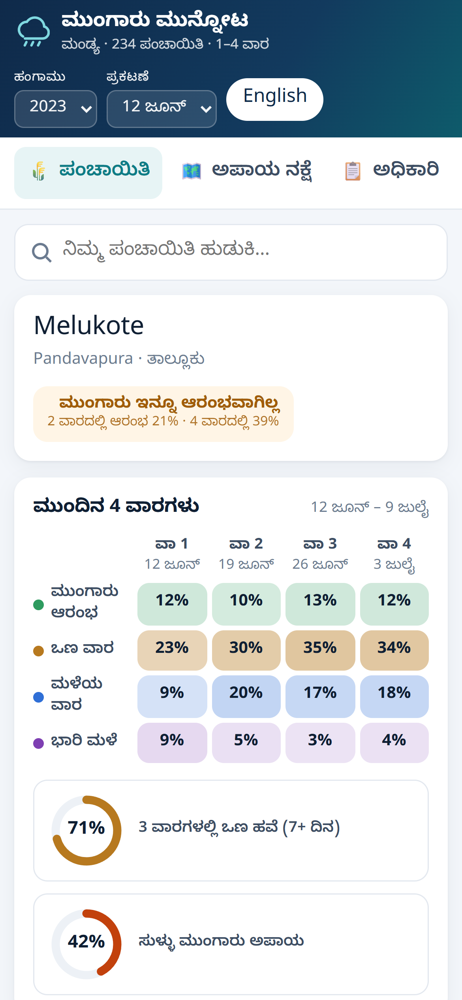
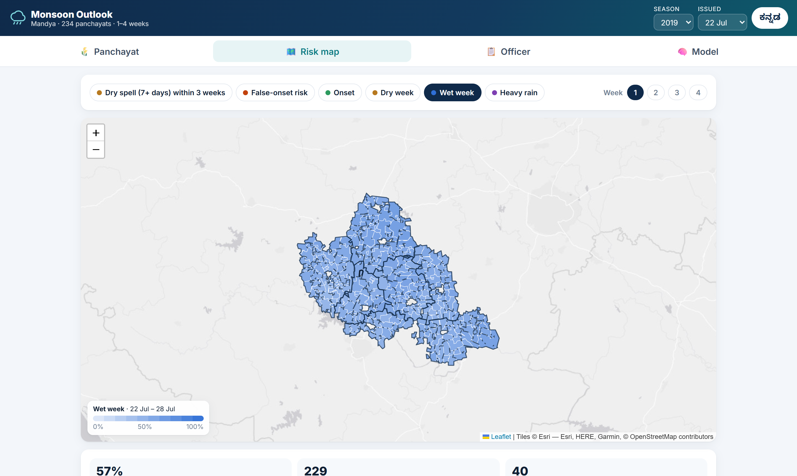

# Monsoon Outlook: hyperlocal monsoon onset & break prediction

**Smart India Hackathon 2026 · Problem statement SIH26086** (MoES / NCMRWF): *Hyperlocal Monsoon Onset & Break Prediction System*
**Team FAST&CURIOUS**

Monsoon Outlook is a daily, probabilistic **1–4 week outlook for every gram panchayat**. It covers all 234 panchayats of Mandya district, Karnataka. It forecasts:
* monsoon onset;
* false onset;
* dry spells;
* dry, wet and heavy-rain weeks.

An expert-system advisory engine turns these probabilities into crop advice in **Kannada and English**. The advice is delivered through a web app, SMS / WhatsApp text and an officer dispatch queue.

<p align="center">
  
  &nbsp;
  
</p>

* **Submission deck:** [`docs/SIH26086_Monsoon_Outlook_FAST_CURIOUS.pdf`](docs/SIH26086_Monsoon_Outlook_FAST_CURIOUS.pdf) (PPTX alongside)
* **Full results:** [`docs/results_ps26086.md`](docs/results_ps26086.md)

---

## Run it in 1 minute

```bash
git clone https://github.com/RohitBharadwaj-rvu/SIH-26086-monsoon-outlook.git
cd SIH-26086-monsoon-outlook
python -m http.server 8766 --directory monsoon/frontend
```

Open <http://localhost:8766>. The app is static: no install and no API keys.

It replays nine seasons (2015–2023), and every probability shown comes from models that never saw that season. It has four tabs:
* **Panchayat:** the farmer view.
* **Risk map:** the map of all 234 panchayats.
* **Officer:** the officer's alert queue.
* **Model:** the ML view. It shows the validated skill, what the system can and cannot forecast, and reliability charts.

Use the **ಕನ್ನಡ** button to switch language.

Issue a full outlook for any date from the command line:

```bash
pip install -r requirements.txt
python -m outlook.issue 2023-06-12 --out outlook.json
```

This writes 18 probabilities and ranked advisories for all 234 panchayats, in under 15 s on a laptop CPU.

---

## How it works

| Step | What | Code |
|---|---|---|
| 1 · Inputs | CHIRPS v2.0 0.05° daily rain 1981–2023, area-weighted to each panchayat polygon; real-time MJO (ROMI), BSISO, Niño 3.4, DMI | `outlook/build.py` |
| 2 · Sub-seasonal outlook | 18 regularised logistic models (event × week) with MJO/BSISO × season interactions | `outlook/model.py` |
| 3 · Weather-model hybrids | NOAA **GEFSv12** 11-member ensemble (quantile-mapped, event rules per member), **GFS** days 1–16, our **v3** transformer + diffusion downscaler (0.25° → 0.05°) | `outlook/stack_gefs2.py`, `stack_gfs.py`, `stack_ens.py`, `stack_v3.py` |
| 4 · Validation gate | A hybrid replaces the outlook only if it beats it on unseen seasons **and** its 90 % CI is above zero (rule fixed in advance) | `outlook/select.py` |
| 5 · Advisories & delivery | Ranked red / amber / green crop advisories (Kannada / English), web app, SMS / WhatsApp text | `outlook/advisory.py`, `monsoon/` |

**Validation:**
* 43-season season-blocked cross-validation.
* Leave-one-season-out tests for every hybrid. GEFS uses 20 reforecast seasons, plus an **independent test on real operational forecasts of 2021–2023**.
* Look-ahead audits: real-time indices only, causal onset state, and a test that inputs are bit-identical when future rain changes.

## Results

Brier skill score vs. the long-term average, on seasons the models never saw (0 = no better than climatology):

| Event | Week 1 | Week 2 | Week 3 | Week 4 |
|---|---|---|---|---|
| Dry week | **+0.16** | **+0.15** | **+0.08** | **+0.06** |
| Wet week | **+0.23** | +0.03 | – | – |
| Dry spell ≥ 7 days within 3 weeks | **+0.08** | | | |
| False onset within 3 weeks | **+0.06** | | | |

* **Reliability:** dry-week forecasts are calibrated within 1.2–1.9 %.
* **Honest limits:** heavy-rain days and onset timing in weeks 1–3 show no reliable skill. The app says so, and heavy-rain alerts are capped at amber.

Details, per-target tables and reliability are in [`docs/results_ps26086.md`](docs/results_ps26086.md).

## Reproduce the pipeline

```bash
python -m outlook.build <chirps_dir> outlook/data/idx      # panchayat rain + climate indices
python -m outlook.model                                      # 18 outlook models + 43-season CV
python -m outlook.stack_v3 && python -m outlook.stack_v3 final
python outlook/merge_gfs16.py && python -m outlook.stack_gfs ckpts/gfs16/all
python -m outlook.stack_gefs2 ckpts/gefs                     # calibrated GEFS + GFS/GEFS average
python -m outlook.stack_ens ckpts/ens                        # v3 diffusion ensemble (out-of-fold)
python -m outlook.select                                     # validation gate -> final_selection.json
python -m outlook.reliability
python -m monsoon.build_bundle --source real                 # web-app data
python scripts/report_ps26086.py                             # docs/results_ps26086.md
```

Forecast archives are fetched with the CPU kernels in `kaggle/gfs16/` and `kaggle/gefs/` (NOAA AWS Open Data and NCAR RDA). The trained outlook models (`outlook/models/`) and all validation outputs (`outlook/results/`) are committed, so the app and `outlook.issue` work without re-running anything.

## Repository layout

| Path | Contents |
|---|---|
| `monsoon/` | PS 26086 web app (`frontend/`) and its data builder |
| `outlook/` | Sub-seasonal outlook, hybrids, selection, advisories, issue CLI; models and results |
| `sihv3/` | v3 spatiotemporal transformer + residual diffusion downscaler (week-1 model) |
| `demo/` | Web demo of the v3 downscaler (FastAPI) |
| `data_pipeline/`, `kaggle/` | Data fetchers and Kaggle job launchers |
| `docs/` | Results, deck, feasibility study, decision log, reports |

## Data sources

All data is public:
* **CHIRPS v2.0:** Funk et al. 2015, UCSB Climate Hazards Center.
* **NOAA GEFS / GFS:** AWS Open Data and NCAR RDA ds084.1.
* **NOAA PSL real-time OMI (ROMI)**, NOAA CPC Niño 3.4 and NOAA PSL DMI.
* **Kikuchi real-time BSISO index.**
* **ERA5 / ERA5-Land and Copernicus GLO-30:** used by the v3 downscaler.

## Background: the v3 downscaler

This repository grew out of our SIH26074 work on panchayat-scale weather downscaling. The v3 model is a spatiotemporal transformer with a cross-fitted residual-diffusion ensemble. It downscales GFS 0.25° forecasts to a 0.05° grid. In this project it supplies the week-1 ensemble used by the outlook. See `docs/final_report.md` and `reports/final_system_report.md`.
